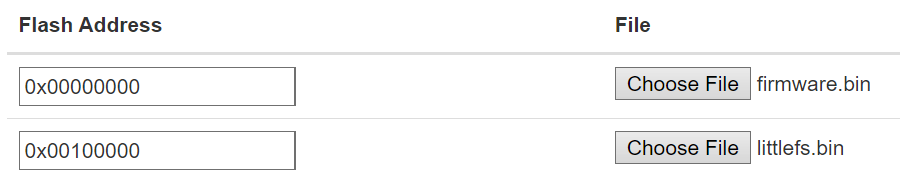

# General Concept
This program uses an algorithm to analyze the IR (infrared) protocol of any device that has an IR-based remote control.

The program later constructs and sends custom messages based on the learned protocol to the device.

The esp-remote connects to the internet via Wi-Fi and can then be controlled from anywhere using a browser.

# Requirements
* ESP8266 Nodemcu v2 microcontroller (less then 5$ on aliexpress)
* IR LED (can be taken out of an old IR remote)
* IR receiver (such as the one that comes with the arduino starter kit)

# Quick Start Guide
## Set up physical components.
1. Connect the IR LED to pin D2 and ground, make sure to put the right resistor for your LED.
2. Connect the IR receiver to 3.3V, ground and the data pin to D1.

## Flash the esp-remote software onto the esp.
1. Get the program's binary files `firmware.bin` and `littlefs.bin` from the [releases](https://github.com/orgaPumpkin/esp-remote/releases) page.
2. Go to the [esptool web page](https://espressif.github.io/esptool-js/).
3. Connect the esp to your computer, click connect and select your esp device's port.
4. Upload the `firmware.bin` file at address 0x00000000 and the `littlefs.bin` file at 0x00300000.
   Your setup should look like this:

   
5. Click program and wait for the upload to finish (the terminal shows `leaving...`), then click disconnect.

## Set up WiFi connection.
1. On first boot, the esp-remote will enter AP mode, which means it will create its own Wi-Fi network.
   Connect to the `ESP-remote` network.
2. In the browser go to http://192.168.4.1.
3. Login with the default credentials (`username: admin`, `password: admin`).
4. Click `Setup` section under _Wi-Fi_ enter the name and password to your Wi-Fi network (case-sensitive) and click `Set WiFi details`.

   While you do that, you can also change the login credentials to the esp-remote.
5. Restart the esp-remote via the physical `RST` button.
   Wait until the board's led turns off to indicate that the esp-remote connected to the Wi-Fi successfully.

   If the esp-remote wasn't able to connect to Wi-Fi in 30 seconds, it will revert to AP mode.
6. Open your router's configuration, in the clients list find the one that starts with `ESP-`,
   copy the local ip address of your esp-remote - this is the ip to access the esp-remote.

   If you want, while you're in the router configuration,
   you can also set port forwarding for your esp-remote to be able to access it from any network.

## Read the terminology document.
To be able to set up your device's IR protocol correctly, you should read [this](terms.md) document.

## Set up the first constant message.
1. Go to the esp-remote web page with the new ip and login.
2. We will start with the "Default" device profile, click the `edit` next to the default profile.
3. Choose which constant message you're going to record. My recommendation is to start with an "off" message.
4. In the web page under _Constants_ write your constant's name ("off" in my example).
5. Click `Add constant` and then send the wanted message with your device's remote.
   Make sure to point the remote at the IR receiver.
6. Go back to the _profiles_ page by clicking `Back to profiles`. Then, click on the "Default" profile to get to the _remote_ page.
7. Try your new constant by clicking on it in the webpage. Make sure that the LED is pointing at your device.

## Set base data message.
The first step in configuring a device with data messages is setting a basic example message.
1. Go back to the profile's _edit_ page.
2. Click `Set base data message` and then send any data message with your device's remote.
3. Repeat step two 3–4 times to make sure that the whole message is being received.
   make sure that the last message you record has the maximum length you've gotten.
4. Try the base data message by clicking `Send base data message`.

## Set up data message fields.
1. Choose what field you want to add, enter the field's name under _Data message_.
   and click `Add field`.
2. Enter the name of the option you want to add, then click `Add option` and send a data message with the wanted option.
3. Repeat step 2 so you have at least two options configured.
   **Make sure that all the fields in the data message apart from the one you're currently editing stay the same.**
4. Navigate back to the _remote_ page.
5. Try out your field by selecting the option you want under _Data message_, and then click `Send data message`.
6. Repeat until you’ve set all the wanted fields.

## Enjoy your new-old smart home device :)

# Additional Features
## Field Disabling By Option
This is a feature that handles an edge case in which there is a field that doesn't exist in a specific option.
For example, The `temperature` field in an ac device doesn't exist while in `fan only` mode.

In this case, sending a data message that contains the `temperature` field might not work.

The solution for this is going to the field edit page of the `mode` field,
and selecting in the `fan only` option to disable the `temperature` field while this option is selected.

## Device Profiles
This feature allows seamless switching between different IR devices.

All you need to do is press `Add Profile` in the _profiles_ page and then give it a name.
Now you can set up another device and use both of them parallely.
